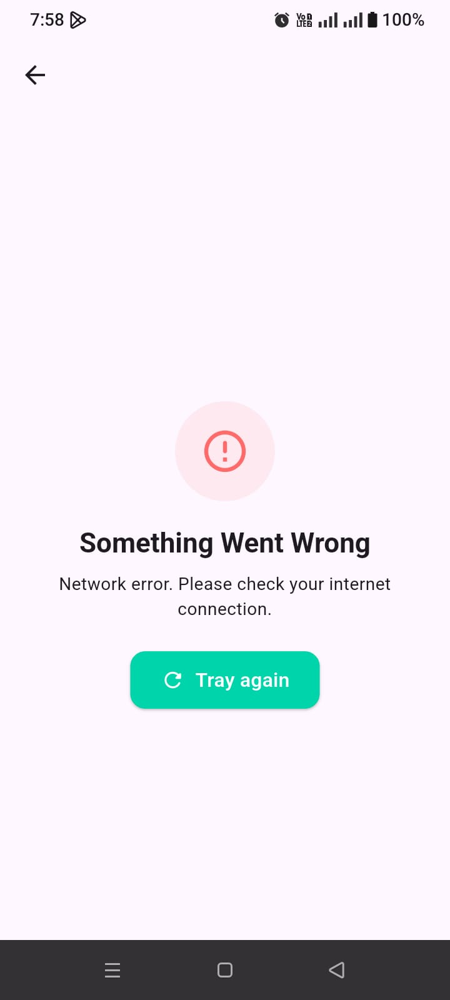
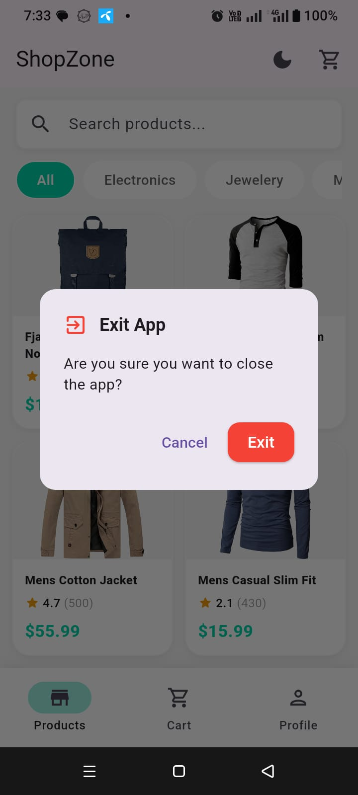
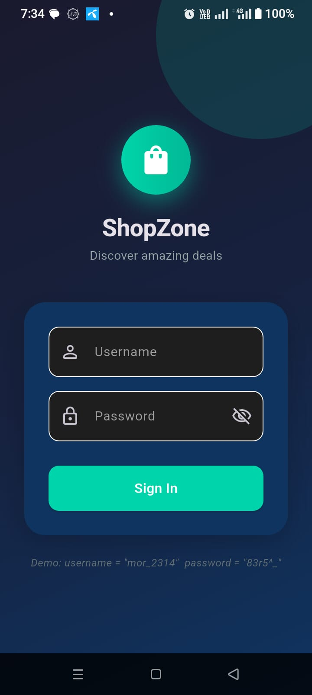
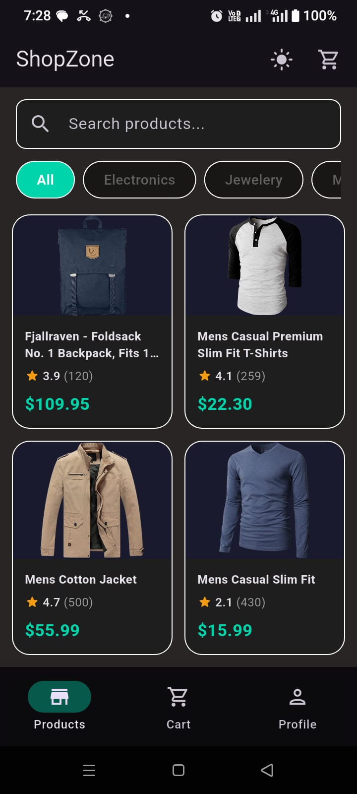
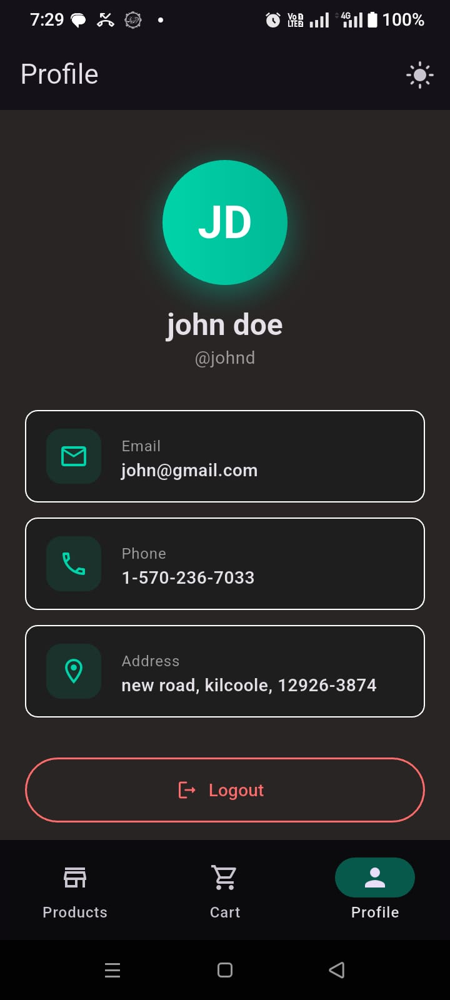

# e_comm_app

A new Flutter project.

## Getting Started

This project is a starting point for a Flutter application.

A few resources to get you started if this is your first Flutter project:

# 🛒 Flutter E-Commerce App (GetX)

A complete Flutter e-commerce application built using **Flutter** and **GetX**
for state management, navigation, and dependency injection.  
The app consumes data from **FakeStoreAPI** and demonstrates a real-world
e-commerce workflow.

---

## 📱 App Overview

This application allows users to:
- Log in using demo credentials (username: mor_2314 password: 83r5^_)
- Browse and search products
- View product details
- Add products to a shopping cart
- Manage cart items
- View user profile
- Use the app in light and dark themes

---

##  Features Working

###  Authentication
- Login with username & password
- Form validation (required fields)
- Error handling on invalid login
- Logout functionality
- Session handling using controllers

###  Product Listing
- Fetch products from API
- Grid layout (2 columns)
- Pull-to-refresh
- Search products by name
- Filter products by category
- Loading & error states
- Offline handling UI

###  Product Detail Screen
- Full product image
- Title, price, category
- Rating & review count
- Product description
- Add to cart button

###  Cart Management
- Add items to cart
- Increase / decrease quantity
- Remove items from cart
- Real-time total calculation
- Empty cart state
- Cart badge showing item count on bottom navigation

###  Profile Screen
- Display user information
- Avatar with initials
- Logout option

###  Theme Management
- Light & Dark mode support
- Adaptive UI based on theme

## 🎨 UI/UX Features

- Material 3 Design
- Smooth animations and transitions
- Hero animations for product images
- Loading states with CircularProgressIndicator
- Error states with user-friendly messages
- Empty states with helpful icons and text
- Pull-to-refresh gestures
- Search with debouncing
- Responsive grid layout
- Card-based UI design
- Badge notifications on cart icon

## 📸 Screenshots

### 🌞 Light Theme







---

### 🌙 Dark Theme








## ▶ How to Run the App

Follow the steps below to run the project locally:

### 🔹 Prerequisites
- Flutter SDK (latest stable)
- Dart SDK
- Android Studio / VS Code
- Android Emulator or Physical Device

### 🔹 Steps

```bash
git clone https://github.com/izharbadshah/flutter_ecommerce_app.git
cd flutter_ecommerce_app
flutter pub get
flutter run

